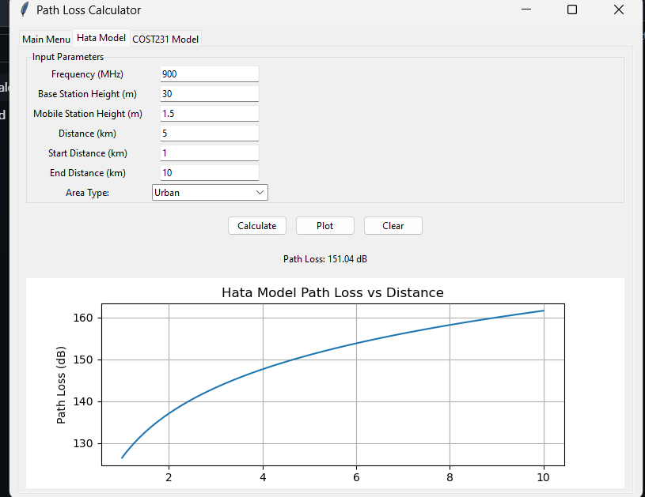
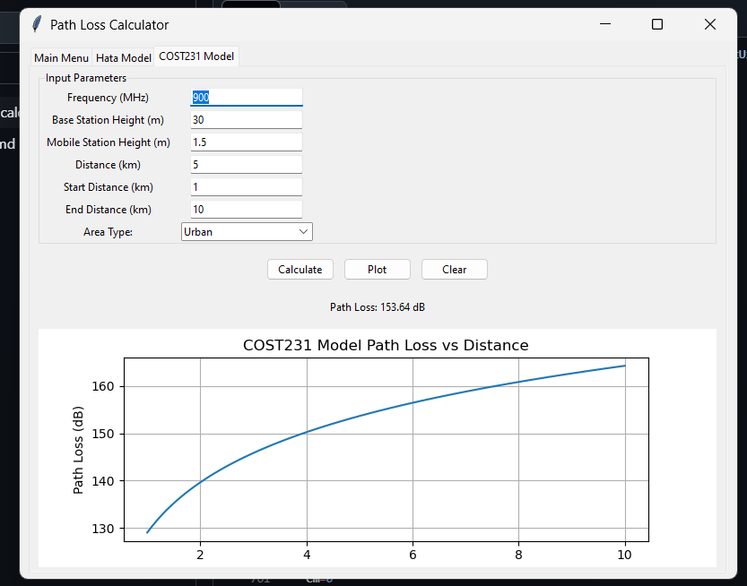

# Path Loss Calculator

A Python-based implementation of radio propagation path loss models including Hata Model and COST231 Model.

## Project Overview
This calculator provides path loss predictions for urban, suburban, and rural environments using two widely used models:
- Hata Model (150-1500 MHz)
- COST231 Model (1500-2000 MHz)

## Features
- Interactive GUI using tkinter
- Real-time path loss calculations
- Graphical visualization of path loss vs distance
- Support for different environment types:
  - Urban
  - Suburban
  - Rural
- Error handling and input validation
- Clear and user-friendly interface

## Models Specifications

### Hata Model
- Frequency range: 150-1500 MHz
- Base station height: 30-200m
- Mobile station height: 1-10m
- Distance: 1-20km
- Environments: Urban, Suburban, Rural

### COST231 Model
- Frequency range: 1500-2000 MHz
- Base station height: 30-200m
- Mobile station height: 1-10m
- Distance: 1-20km
- Environments: Urban, Suburban, Rural

## Screenshots
### Hata Model


### COST231 Model


## Installation

1. Clone the repository:
```bash
git clone <repository-url>
cd Path-loss-calculator